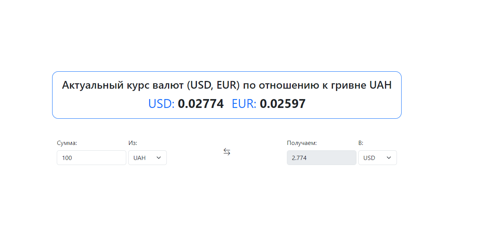

# CurrencyExchanger

This project was generated with [Angular CLI](https://github.com/angular/angular-cli) version 16.2.5.

Before running this application, make sure you have the following software installed on your computer:

- Node.js: You can download it from [nodejs.org](https://nodejs.org/)
- [Angular CLI](https://angular.io/cli) - You can install it globally using npm: `npm install -g @angular/cli`

## Getting Started

Follow these steps to run the app locally:

1. **Clone the repository**:
`git clone https://github.com/DmytroTarasiuk/currency_exchanger.git`

2. **Navigate to the project directory**:
`cd currency_exchanger`

3. **Install Dependencies**:
`npm install`

4. **Start the Development Server**:
`ng serve`

